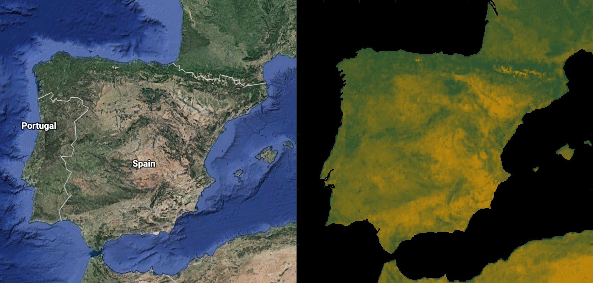

# Remote Sensing the Earth 🌍
A 10-day paired university project in image processing, that I took with <a href="https://www.linkedin.com/in/gregwilko">Greg Wilkinson</a> in November 2017.

The project involved implementing remote sensing methods in MATLAB to analyse satellite images of the Earth (from <a href="https://www.eumetsat.int/website/home/index.html">EUMETSAT</a>). As described in our report, we removed cloud, extracted useful information about surface level features and calculated the Normalised Difference Vegetation Index (NDVI), observing its seasonal fluctuation in Central Africa.

I have uploaded some very 'quick and dirty', rough code alongside the report for my own reference.

